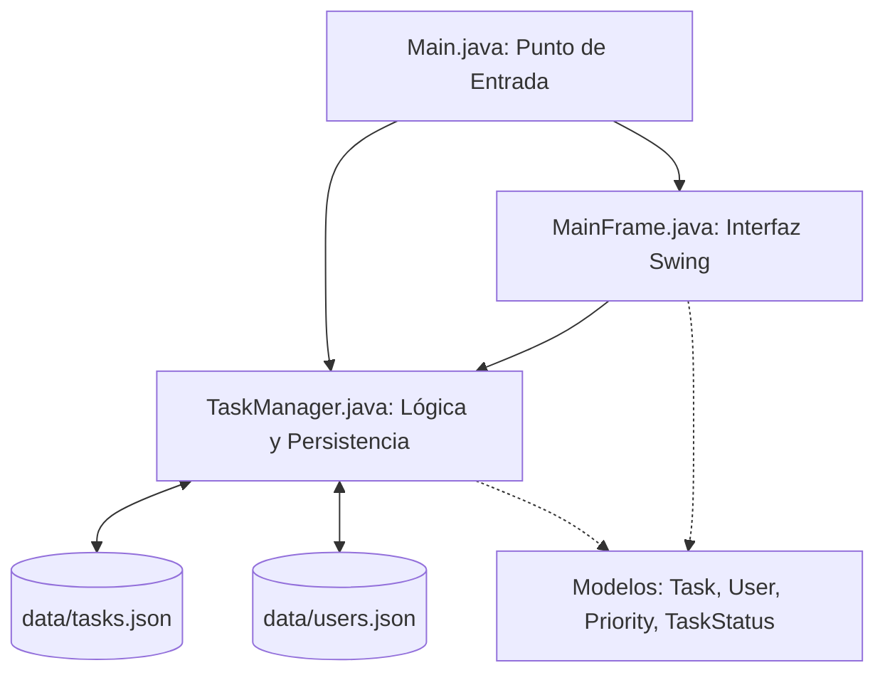

# TaskFlow - Gestor de Tareas

[](#)
[](#)
[](#)
[](#)

> TaskFlow es una plataforma de gestión de tareas inspirada en Jira y Trello, diseñada para ofrecer un flujo de trabajo agilizado mediante un tablero Kanban interactivo, organización por prioridades y una vista centralizada de tareas asignadas por usuario.

---

## Stack Tecnológico

El proyecto utiliza tecnologías nativas de la plataforma Java junto con librerías estándar para garantizar portabilidad, ligereza y facilidad de mantenimiento:

| Componente | Tecnología / Librería | Propósito |
| :--- | :--- | :--- |
| **Lenguaje de Programación** | Java 17 (JDK) | Desarrollo orientado a objetos claro y estructurado. |
| **Interfaz de Usuario** | Java Swing / AWT | Renderizado de componentes gráficos nativos (`JFrame`, `JTabbedPane`, `JPanel`, `JOptionPane`). |
| **Persistencia de Datos** | Google Gson 2.10+ | Serialización y deserialización de listas Java a archivos en formato JSON. |
| **Diseño y Maquetación** | Layout Managers (`BorderLayout`, `GridLayout`, `BoxLayout`) | Organización limpia y responsiva de elementos en pantalla. |
| **Control de Versiones** | Git + Conventional Commits | Historial de cambios limpio y profesional. |

---

## Arquitectura del Sistema

La arquitectura ha sido diseñada de forma directa para facilitar la explicación y defensa en entornos académicos:



---

## Características Principales

- **Tablero Kanban Interactivo**: Clasificación en 3 columnas virtuales (**Por Hacer**, **En Proceso** y **Finalizado**) con botones para avanzar el estado de una tarea.
- **Gestión de Prioridades**: Organización visual por código de colores (**Alta**: Rojo, **Media**: Naranja/Amarillo, **Baja**: Gris).
- **Vista por Usuario**: Módulo dedicado para consultar las tareas asignadas a cada integrante, ordenadas de mayor a menor prioridad.
- **Interacción Ágil**: Creación de usuarios y tareas mediante cuadros de diálogo integrados con `JOptionPane`.
- **Persistencia Automática**: Guardado y carga en caliente en archivos locales JSON dentro del directorio `data/`.

---

## Estructura del Código Fuente

```text
src/main/java/com/taskflow/
├── Main.java              # Punto de entrada principal y lanzamiento de la GUI
├── TaskManager.java       # Gestor unificado de tareas, usuarios y persistencia JSON
├── model/                 # Modelos de datos del dominio
│   ├── Task.java          # Estructura de una tarea (título, descripción, prioridad, estado, usuario)
│   ├── User.java          # Estructura de un usuario registrado
│   ├── Priority.java      # Enumeración de prioridades (Alta, Media, Baja)
│   └── TaskStatus.java    # Enumeración de estados (Por Hacer, En Proceso, Finalizado)
└── ui/                    # Capa de presentación gráfica
    └── MainFrame.java     # Ventana principal Swing de alto contraste con pestañas
```

---

## Compilación y Ejecución

### Desde la Terminal

```bash
# Compilar los archivos fuente dirigiendo los binarios a la carpeta 'out'
javac -cp "lib/*" -d out src/main/java/com/taskflow/model/*.java src/main/java/com/taskflow/ui/*.java src/main/java/com/taskflow/*.java

# Ejecutar la aplicación
java -cp "out;lib/*" com.taskflow.Main
```

### Mediante Scripts en Windows

- Ejecutar `compile.bat` para realizar la compilación automática.
- Ejecutar `run.bat` para iniciar el programa.

---

## Guía de Exposición para la Presentación Académica

Para defender el código durante la evaluación:

1. **`Main.java`**: "Es el punto de arranque que crea la instancia de `TaskManager` y lanza la interfaz `MainFrame`."
2. **`TaskManager.java`**: "Administra los datos en memoria, ejecuta las búsquedas con bucles `for` y realiza el almacenamiento automático en JSON mediante Gson."
3. **`MainFrame.java`**: "Construye la ventana principal en Swing con un `JTabbedPane` para separar el tablero Kanban de la vista por usuario."

---

## Autores y Desarrolladores

Este proyecto ha sido diseñado y desarrollado por:

* **Andrés Guerra**
* **Diego Mantilla**

---

## Licencia

Proyecto desarrollado con fines académicos y educativos. Todos los derechos reservados.
