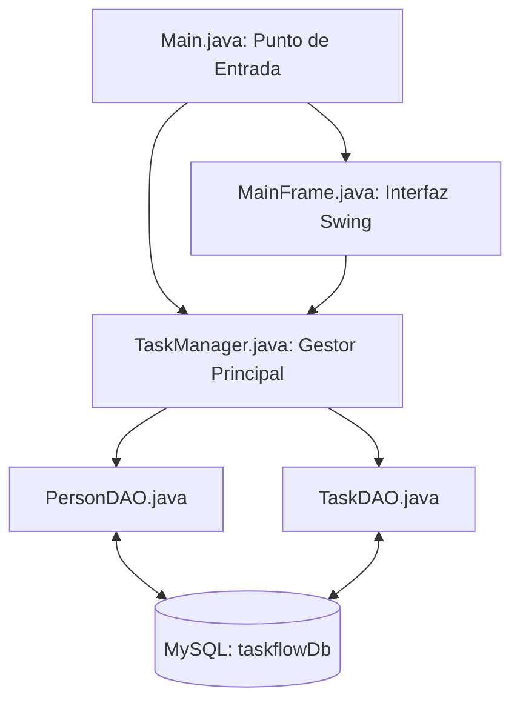

# TaskFlow - Gestor de Tareas (MySQL Database Architecture)

[](#)
[](#)
[](#)
[](#)

> TaskFlow es una plataforma de gestión de tareas con arquitectura de base de datos MySQL relacional (7 tablas en 4NF), interfaz Swing interactiva y patrón DAO para la persistencia transaccional.

---

## Stack Tecnológico

| Componente | Tecnología / Librería | Propósito |
| :--- | :--- | :--- |
| **Lenguaje de Programación** | Java 17 (JDK) | Desarrollo orientado a objetos estructurado. |
| **Base de Datos** | MySQL Server / JDBC | Almacenamiento relacional normalizado. |
| **Gestión de Proyectos** | Apache Maven | Administración de dependencias (`mysql-connector-j`). |
| **Interfaz de Usuario** | Java Swing / AWT | Componentes gráficos nativos e interactivos. |
| **Patrón de Arquitectura** | DAO (Data Access Object) | Separación de lógica de negocio y persistencia SQL. |

---

## Esquema de Base de Datos Relacional

La base de datos `taskflowDb` está estructurada en las siguientes 7 tablas interconectadas:

- `type_person`: Catálogo de roles (Desarrollador, Líder de Proyecto, Administrador).
- `person`: Registro de usuarios/integrantes.
- `team`: Grupos o equipos de trabajo.
- `team_person`: Relación N:M entre personas y equipos.
- `status_task`: Catálogo de estados (Por Hacer, En Progreso, Completada).
- `task`: Registro principal de tareas.
- `assement_task`: Asignación y evaluación de tareas a personas.

---

## Arquitectura del Sistema



---

## Compilación y Ejecución

### Mediante Maven

```bash
# Compilar proyecto
mvn clean compile

# Ejecutar proyecto desde consola
mvn exec:java -Dexec.mainClass="com.taskflow.Main"
```

### Ejecución Directa en IDE
Ejecuta la clase `com.taskflow.Main` directamente desde tu IDE preferido (VS Code, IntelliJ, Eclipse, NetBeans).

---

## Autores y Desarrolladores

- **Diego Mantilla**
- **Andrés Guerra**
