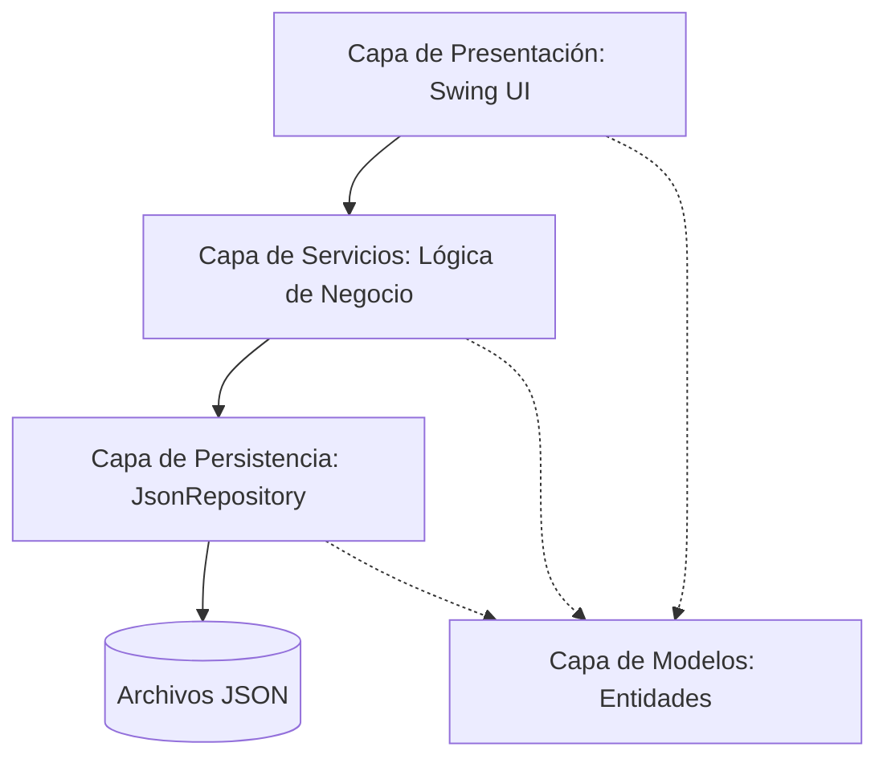

# TaskFlow - Gestor de Tareas

[](#)
[](#)
[](#)

> TaskFlow es una plataforma de productividad y organización de tareas inspirada en metodologías ágiles. La aplicación implementa un flujo de trabajo Kanban clásico combinado con la potencia de una interfaz gráfica de usuario desarrollada en Java Swing y una persistencia local estructurada mediante archivos JSON.

---

## Stack Tecnológico

El proyecto ha sido construido utilizando tecnologías nativas de la plataforma Java y librerías estándares para garantizar la portabilidad y ligereza del sistema:

| Componente | Tecnología | Propósito |
| :--- | :--- | :--- |
| **Lenguaje de Programación** | Java 17 (JDK) | Garantiza el uso de características modernas y seguras del lenguaje. |
| **Interfaz de Usuario** | Java Swing / AWT | Renderizado de componentes gráficos nativos y manejo de eventos. |
| **Persistencia** | Gson (Google) 2.10+ | Serialización y deserialización de objetos Java a archivos estructurados en JSON. |
| **Gestión de Diseño** | Layout Managers avanzados | Distribución fluida y responsiva de las tarjetas en el tablero. |

---

## Arquitectura del Software

TaskFlow adopta un patrón de diseño arquitectónico estructurado por capas para separar la lógica de presentación visual, las reglas de negocio y el almacenamiento persistente de datos.



### Capas del Sistema

- **Modelos (`com.taskflow.model`):** Contiene las entidades principales como `Task`, `User`, `Project`, y los enums que definen el estado de las tareas (`TaskStatus`) y la prioridad (`Priority`).
- **Servicios (`com.taskflow.service`):** Lógica encargada de coordinar las acciones de las tareas, la asignación a usuarios y la validación de dependencias del negocio.
- **Repositorio (`com.taskflow.repository`):** Maneja la persistencia en disco de manera transparente utilizando archivos estructurados en formato JSON.
- **Interfaz (`com.taskflow.ui`):** Componentes gráficos interactivos que incluyen diálogos modales para la edición de tareas, tarjetas Kanban personalizadas y un panel de visualización consolidado por usuario.

---

## Características Principales

### Tablero Kanban Interactivo
El tablero central organiza el flujo de trabajo en tres columnas claramente definidas:
- **Por Hacer (To Do):** Tareas pendientes por iniciar.
- **En Progreso (In Progress):** Tareas que se están ejecutando activamente.
- **Finalizado (Done):** Tareas concluidas con éxito.

### Gestión de Prioridades y Proyectos
- Clasificación visual de prioridad: Alta, Media y Baja para optimizar la toma de decisiones.
- Agrupación por Proyectos: Facilidad para segmentar tareas complejas en microproyectos independientes.

### Dashboard Personalizado de Usuario
Permite a cada miembro del equipo acceder a una vista centralizada de sus tareas asignadas, organizadas jerárquicamente por prioridad para enfocar el esfuerzo diario de manera eficiente.

---

## Estructura del Código Fuente

```text
src/main/java/com/taskflow/
├── Main.java              # Clase de inicio y punto de entrada al sistema
├── model/                 # Entidades y enumeraciones del negocio
│   ├── Priority.java      # Definición de niveles de prioridad
│   ├── TaskStatus.java    # Estados del flujo Kanban
│   ├── Task.java          # Datos estructurales de una tarea
│   ├── User.java          # Información de usuarios registrados
│   └── Project.java       # Agrupación lógica de tareas
├── service/               # Servicios mediadores de negocio
│   ├── TaskService.java
│   ├── UserService.java
│   └── ProjectService.java
├── repository/            # Acceso a datos locales
│   └── JsonRepository.java # Operaciones de lectura y escritura en JSON
└── ui/                    # Componentes gráficos de la interfaz
    ├── MainFrame.java     # Ventana principal del tablero
    ├── TaskCard.java      # Componente visual para cada tarea individual
    ├── KanbanColumn.java  # Columna contenedora del tablero Kanban
    ├── TaskDialog.java    # Formulario para creación y edición
    ├── UserPanel.java     # Panel lateral con tareas del usuario activo
    └── ThemeManager.java  # Control centralizado de colores e identidad visual
```

---

## Compilación y Ejecución

Para iniciar la aplicación localmente, asegúrese de tener instalado el JDK 17 o superior y siga las siguientes instrucciones en su terminal:

```bash
# Paso 1: Compilar los archivos fuente dirigiendo los binarios al directorio de salida
javac -cp "lib/*" -d out src/main/java/com/taskflow/**/*.java src/main/java/com/taskflow/*.java

# Paso 2: Ejecutar la aplicación enlazando la carpeta de salida y las librerías necesarias
java -cp "out;lib/*" com.taskflow.Main
```

---

## Convención de Commits

El desarrollo sigue el estándar de Conventional Commits para mantener un historial de cambios limpio y legible:

| Prefijo | Propósito del Commit |
| :--- | :--- |
| `feat` | Implementación de una nueva característica o funcionalidad. |
| `fix` | Corrección de un fallo o error en el sistema. |
| `docs` | Actualización de documentación (código, manuales, README). |
| `style` | Cambios que no afectan la lógica (espacios, formateo, interfaz visual). |
| `refactor` | Reorganización de código sin alterar su comportamiento externo. |
| `test` | Incorporación o corrección de pruebas automatizadas. |

---

## Autores

Proyecto desarrollado por:
- **Andrés Guerra**
- **Diego Mantilla**

---

## Licencia

Este proyecto se distribuye bajo fines puramente académicos y educativos. Todos los derechos reservados.
